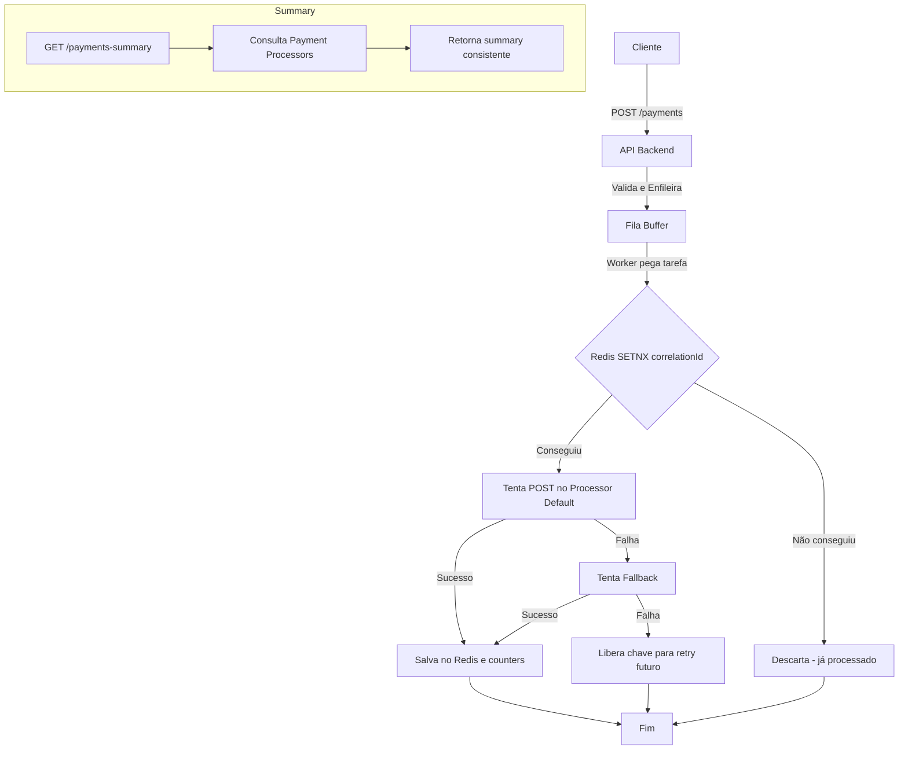

# Rinha de Backend 2025 - Documentação da Solução

## Sumário
- [Visão Geral](#visão-geral)
- [Endpoints da API](#endpoints-da-api)
- [Fluxo de Processamento](#fluxo-de-processamento)
- [Consistência e Idempotência](#consistência-e-idempotência)
- [Armazenamento e Fila](#armazenamento-e-fila)
- [Resumo de Pagamentos](#resumo-de-pagamentos)
- [Desenho do Fluxo (Mermaid)](#desenho-do-fluxo-mermaid)
- [Ambiente Docker](#ambiente-docker)

---

## Visão Geral
Esta solução foi desenvolvida para a Rinha de Backend 2025, integrando pagamentos com dois Payment Processors (default e fallback) e garantindo máxima performance e consistência, mesmo sob alta concorrência e múltiplas instâncias.

## Endpoints da API

### POST /payments
Recebe requisições de pagamento:
```json
{
  "correlationId": "uuid-obrigatorio",
  "amount": 19.90
}
```
- **correlationId**: obrigatório, único, UUID.
- **amount**: obrigatório, decimal.
- **Resposta**: HTTP 2XX (qualquer), corpo ignorado.

### GET /payments-summary?from=...&to=...
Retorna o resumo dos pagamentos processados:
```json
{
  "default": {
    "totalRequests": 1234,
    "totalAmount": 5678.90
  },
  "fallback": {
    "totalRequests": 12,
    "totalAmount": 34.56
  }
}
```
- **from/to**: timestamps ISO8601 (opcionais).
- **Resposta**: sempre consistente com os Payment Processors.

## Fluxo de Processamento
1. O pagamento é recebido e validado.
2. É enfileirado em uma fila buffer (alta concorrência).
3. Workers processam a fila:
   - Tenta reservar o `correlationId` no Redis (`SETNX`).
   - Se conseguir, tenta POST no Payment Processor default.
   - Se falhar, tenta fallback.
   - Só após sucesso no POST, incrementa counters e salva o pagamento.
   - Se ambos falharem, libera o `correlationId` para retry futuro.
4. O summary é obtido diretamente dos Payment Processors para garantir consistência.

## Consistência e Idempotência
- **Redis** é usado para garantir que cada pagamento seja processado uma única vez, mesmo com múltiplas instâncias.
- O summary é sincronizado com os Payment Processors via `/admin/payments-summary`.
- Se a consulta externa falhar, faz fallback para o summary local.

## Armazenamento e Fila
- **Redis** armazena pagamentos processados, counters e locks de idempotência.
- **Fila em memória** (buffer) garante alta performance e desacoplamento entre recebimento e processamento.

## Resumo de Pagamentos
- O endpoint `/payments-summary` reflete exatamente o que os Payment Processors processaram, evitando penalizações por inconsistência.

## Desenho do Fluxo (Mermaid)


## Ambiente Docker
- O `docker-compose.yml` inclui:
  - 2 instâncias do backend
  - Nginx para balanceamento
  - Redis para armazenamento e idempotência
  - Payment Processors (externos)

---

**Observação:**
- O backend está pronto para escalar horizontalmente e manter consistência total.
- O summary é sempre consistente com os Payment Processors, mesmo que isso penalize um pouco a performance.
